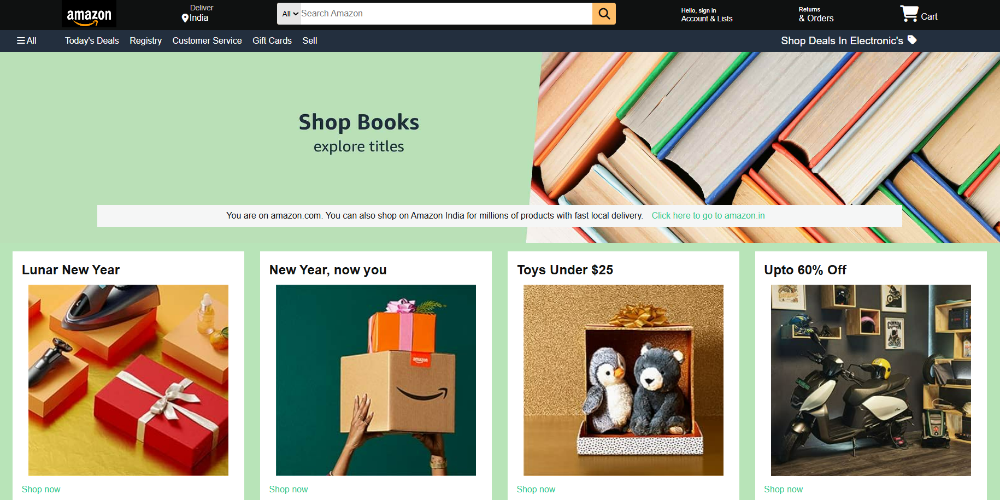

### Amazon-Inspired  Shopping Portal

**Overview**
This project is a simulated online shopping platform designed to mimic the basic functionality of Amazon. It was created using HTML, CSS, and JavaScript to provide a user-friendly interface for browsing, selecting, and purchasing products.

**Features**
* Product catalog with various product categories
* Online shopping landing page

**Screenshot**

**Technologies Used**
* HTML: Structure of the web pages
* CSS: Styling and layout of the website
* JavaScript: Dynamic behavior and user interactions

**Installation**
To run this project locally:
1. Clone the repository: `git clone https://github.com/your-username/amazon-clone.git`
2. Open the project in a code editor.
3. Open `index.html` in a web browser.

**Usage**
* Browse through product categories
* Search for specific products
* Add items to the shopping cart
* Proceed to checkout (simulated)

**Note:** This project is a basic simulation and does not include actual payment processing or product inventory management.

**Future Improvements**
* Implement user authentication and account management
* Add product reviews and ratings
* Integrate payment gateway for real transactions
* Enhance product search functionality
* Product search functionality
* Product details page with descriptions and images
* Shopping cart implementation

**Feel free to contribute and add your learning ...!
